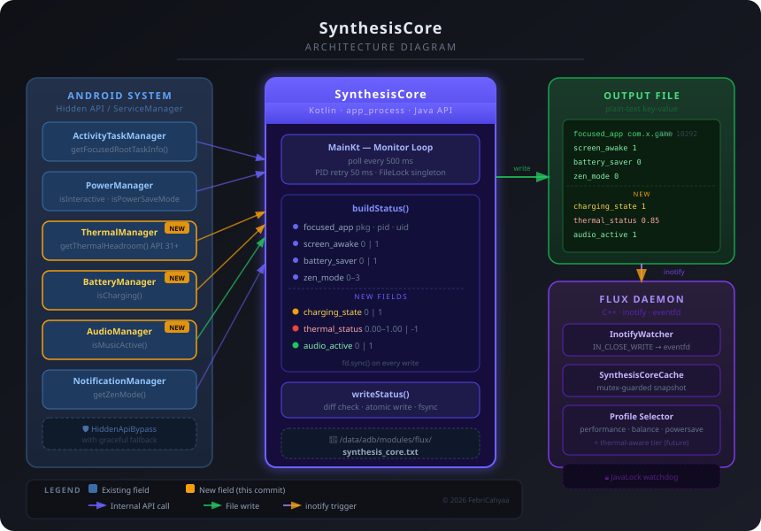

# Synthesis Core

<p align="center">
  
</p>

<p align="center">
  <b>Fast, native Android system monitor — a modern replacement for <code>dumpsys</code></b><br/>
  Built with Kotlin · Runs via <code>app_process</code> · Zero external dependencies
</p>

<p align="center">
  
  
  
  
</p>

---

## What is SynthesisCore?

SynthesisCore is a lightweight background daemon that monitors critical Android system state in real-time and exposes it as a simple plain-text file. It is designed to be polled or watched via `inotify` by other native daemons — most notably [Flux Tweaks](https://github.com/febricahyaa/Flux).

It runs as a standalone process using `app_process`, which gives it access to the full Android Java framework stack (including hidden/internal APIs) without needing to be installed as a regular app.

### Why not `dumpsys`?

| | SynthesisCore | `dumpsys` |
|---|---|---|
| **Speed** | Polls in ~500 ms, sub-50 ms PID retry | Limited to ~1 s intervals |
| **Precision** | Returns exactly the fields you need | Dumps everything, requires custom parsing |
| **Overhead** | Minimal — single persistent process | Spawns a new process on every call |
| **Integration** | `inotify`-friendly file output | Requires shell piping |

---

## Output Format

SynthesisCore writes a plain-text key-value file, updated only when any value changes. Writes are
atomic (`.tmp` + `fsync` + rename), so watchers must listen for `IN_MOVED_TO` as well as `IN_CLOSE_WRITE`.
Numbers always use `.` as the decimal separator, whatever the device locale.

```text
synthesis_version 3
focused_app com.rhmsoft.edit.pro 4720 10292
screen_awake 1
battery_saver 0
zen_mode 0
charging_state 1
thermal_status 0.85
audio_active 1
thermal_api_available 1
kernel_is_gki 1
thermal_level 0
battery_level 87
battery_temp 34.5
call_active 0
```

Consumers must ignore unknown keys. A key that is absent means the value is unsupported on this device.

### Field Reference

| Field | Type | Description |
|---|---|---|
| `synthesis_version` | `int` | Output format / CLI contract version (`Protocol.VERSION`). Missing = 1 |
| `focused_app` | `string int int` | Foreground package name, PID, UID |
| `screen_awake` | `0\|1` | Whether the display is interactive |
| `battery_saver` | `0\|1` | Power Save Mode active |
| `zen_mode` | `0–3` | DND level: 0=off, 1=priority, 2=silence, 3=alarms |
| `charging_state` | `0\|1` | `1` = device is charging (AC / USB / wireless) |
| `thermal_status` | `0.00–1.00` | Thermal headroom (1 s forecast) — `1.0` = cool, `0.0` = throttling. `-1.00` on API < 30 or when the HAL returns NaN |
| `audio_active` | `0\|1` | `1` = music/game audio stream is active |
| `thermal_api_available` | `0\|1` | `1` = `PowerManager.getThermalHeadroom()` exists (API 30+) |
| `kernel_is_gki` | `0\|1` | `1` = kernel reports GKI (`-androidXX-` in `uname -r`) |
| `thermal_level` | `0–6` | `PowerManager.getCurrentThermalStatus()`: 0=none, 1=light, 2=moderate, 3=severe, 4=critical, 5=emergency, 6=shutdown. API 29+ |
| `battery_level` | `0–100` | Battery capacity in percent |
| `battery_temp` | `float` | Battery temperature in °C (from `/sys/class/power_supply/battery/temp`) |
| `call_active` | `0\|1` | `1` = audio mode is a phone call, VoIP/communication or call screening |

---

## Usage

```shell
app_process -Djava.class.path=/sdcard/app-release.apk / \
  --nice-name=FluxSysMon \
  com.febricahyaa.synthesiscore.MainKt \
  /path/to/output/file \
  [/path/to/lock/file]
```

Other modes:

| Command | Purpose |
|---|---|
| `MainKt --once` | Print one status snapshot to stdout and exit (debugging) |
| `MainKt --capabilities` | Print how every provider runs on this device (`EVENT` / `POLL` / `STATIC` / `FAILED`) |
| `MainKt --version` | Print the protocol version |
| `MainKt --resolve [file]` | Resolve binder transaction codes (see below) |

The optional second argument is a lock-file path. If provided, SynthesisCore will acquire an exclusive `FileLock` on startup — any attempt to run a second instance against the same lock will exit immediately with an error.

### Binder transaction resolver (`--resolve`)

Binder transaction codes differ between Android versions and ROMs. The `--resolve` mode is a one-shot
lookup that lets native code (e.g. Flux) issue binder calls directly without keeping a JVM alive:

```shell
app_process -Djava.class.path=/sdcard/app-release.apk / \
  com.febricahyaa.synthesiscore.MainKt --resolve [/path/to/output/file] <<EOF
android.os.IPowerManager.Stub::TRANSACTION_isInteractive
android.app.INotificationManager.Stub::TRANSACTION_getZenMode
EOF
```

```text
android.os.IPowerManager.Stub::TRANSACTION_isInteractive 21
android.app.INotificationManager.Stub::TRANSACTION_getZenMode 123
```

- Input is one `Class::FIELD` per line; nested classes may use `.` or `$` (`IPowerManager.Stub` = `IPowerManager$Stub`). Blank lines and `#` comments are ignored.
- Output goes to stdout, or is written atomically to the given file.
- Entries that cannot be resolved are reported on stderr and omitted from the output.
- Exit code: `0` all resolved, `1` some entries failed, `2` output could not be written.

---

## Commit Roadmap

Development is structured as discrete, reviewable commits. Each commit introduces exactly one new output field and its corresponding Android API integration.

### ✅ v1.0.0 — Initial Release
Core infrastructure: `focused_app`, `screen_awake`, `battery_saver`, `zen_mode`.

### ✅ Field Expansion

**Commit 1 — `feat: add charging_state field`**
- Integrates `BatteryManager.isCharging()`
- Enables Flux to allow more aggressive performance profiles while plugged in
- No version gate required (API 23+, within our minSdk 28)

**Commit 2 — `feat: add thermal_status field`**
- Integrates `PowerManager.getThermalHeadroom(forecast=1s)`
- Returns normalised float `[0.0–1.0]`; gracefully falls back to `-1.00` on API < 31
- Enables thermal-aware profile tiering in Flux (Performance → PerformanceLite → Balance)

**Commit 3 — `feat: add audio_active field`**
- Integrates `AudioManager.isMusicActive()`
- Detects in-game audio to help Flux avoid disruptive profile switches mid-session
- No version gate required

**Commit 4 — `fix: graceful HiddenApiBypass fallback`**
- Wraps `HiddenApiBypass.addHiddenApiExemptions("")` in try/catch
- Logs a warning instead of crashing if bypass fails on future Android versions
- Degrades gracefully: features that depend on private APIs return sentinel values

### ✅ v2.0.0 — Framework rewrite (protocol 3)
- Monolithic poll loop replaced by an event-driven `Engine` with pluggable `StateProvider`s
- Framework listeners instead of polling where available (UID importance, display, thermal status, audio playback, audio mode)
- Public APIs instead of hidden ones where possible (zen mode via `NotificationManager`, thermal APIs called directly)
- New fields: `thermal_level`, `battery_level`, `battery_temp`, `call_active`
- Locale-independent number formatting (fixes `0,85` on comma-decimal locales)
- `--once`, `--capabilities` and `--version` modes

---

## Architecture

SynthesisCore is a small event-driven framework on top of the Android system services:

```
app/src/main/java/com/febricahyaa/synthesiscore/
├── MainKt.kt                 CLI entry point (monitor, --resolve, --once, --capabilities, --version)
├── core/
│   ├── SystemEnvironment     hidden API exemption, main Looper, system Context from ActivityThread
│   ├── Engine                single-Looper scheduler: events + adaptive polls, coalesced writes
│   ├── StateProvider         provider contract (start → sample → stop) and TriggerMode
│   ├── Protocol              field names, output order, locale-independent formatting
│   ├── Binders               ServiceManager / AIDL stub / TRANSACTION_* reflection helpers
│   ├── AtomicFile            tmp + fsync + rename writer
│   └── Log                   stderr logger with de-duplication
├── provider/
│   ├── foreground/           focused_app: TaskResolver (IActivityTaskManager), ProcessTracker,
│   │                         ForegroundAppProvider (UID importance listener trigger)
│   ├── DisplayProvider       screen_awake
│   ├── PowerProvider         battery_saver, zen_mode
│   ├── BatteryProvider       charging_state, battery_level, battery_temp
│   ├── ThermalProvider       thermal_status, thermal_level, thermal_api_available
│   ├── AudioProvider         audio_active, call_active
│   └── KernelProvider        kernel_is_gki
└── resolver/BinderResolver   --resolve mode
```

### How values are collected

Each provider picks the best mechanism the device supports and reports it as its `TriggerMode`:

| Provider | Trigger (EVENT) | Fallback / safety poll |
|---|---|---|
| foreground | `ActivityManager.addOnUidImportanceListener` (@SystemApi, via `Proxy`) | 1 s (0.5 s without listener), 5 s screen off |
| display | `DisplayManager.DisplayListener` | 5 s (1 s without listener) |
| thermal | `PowerManager.addThermalStatusListener` (API 29) | headroom polled every 1 s, 10 s screen off |
| audio | `AudioPlaybackCallback` (API 26), `OnModeChangedListener` (API 31) | 1–5 s, 10 s screen off |
| power | — (change broadcasts are not receivable from `app_process`) | 2 s, 10 s screen off |
| battery | — (same) | 2 s, 30 s screen off |
| kernel | `STATIC` | never |

Why no broadcasts: `app_process` has no app record in ActivityManager, so `registerReceiver` returns
`null` without registering. Binder-callback listeners (display, thermal, audio, UID importance) do not
need one, which is why they are used wherever the platform offers them.

All providers run on one `Looper` thread, so they need no locking. Framework callbacks call
`invalidate()`, which re-samples only that provider; changes within 25 ms are merged into one write.
Poll intervals slow down automatically while the screen is off. A provider that fails to start is
dropped and reported as `FAILED`; the others keep working.

### Adding a field

1. Add the key to `Protocol` (and to `FIELD_ORDER`), bump `Protocol.VERSION`.
2. Write a `StateProvider` (or extend one) that fills the key in `sample()`.
3. Register it in `MainKt.createProviders()`.
4. Teach the consumers (Flux `SynthesisCoreReader`, WebUI monitor store) to parse it.

---

## Building

```shell
# Standard Gradle release build
./gradlew assembleRelease

# Unit tests
./gradlew testDebugUnitTest
```

The APK is self-contained and intended to be run via `app_process`, not installed normally. The `CI` workflow runs unit tests and builds an unsigned APK on every push and pull request (usable for on-device testing, since `app_process` does not check signatures). Signed release builds are produced by the manually triggered `Build` workflow.

**Requirements:** JDK 25 · Android Gradle Plugin 9.x · `compileSdk 36`

---

## License

```
Copyright 2026 FebriCahyaa

Licensed under the Apache License, Version 2.0 (the "License");
you may not use this file except in compliance with the License.
You may obtain a copy of the License at

    https://www.apache.org/licenses/LICENSE-2.0

Unless required by applicable law or agreed to in writing, software
distributed under the License is distributed on an "AS IS" BASIS,
WITHOUT WARRANTIES OR CONDITIONS OF ANY KIND, either express or implied.
See the License for the specific language governing permissions and
limitations under the License.
```
